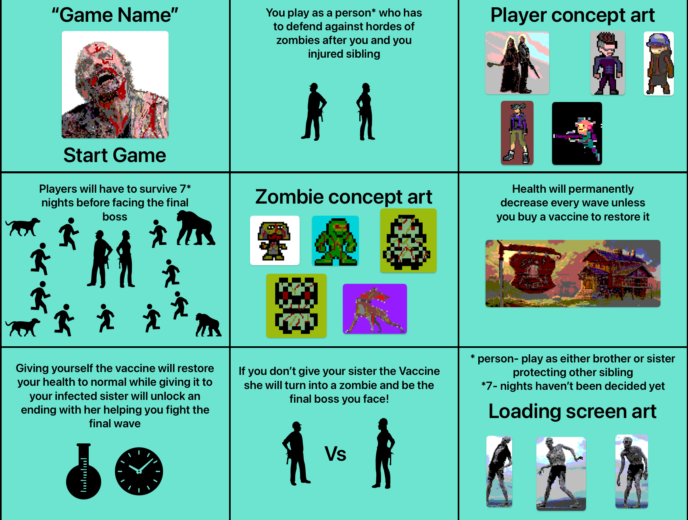
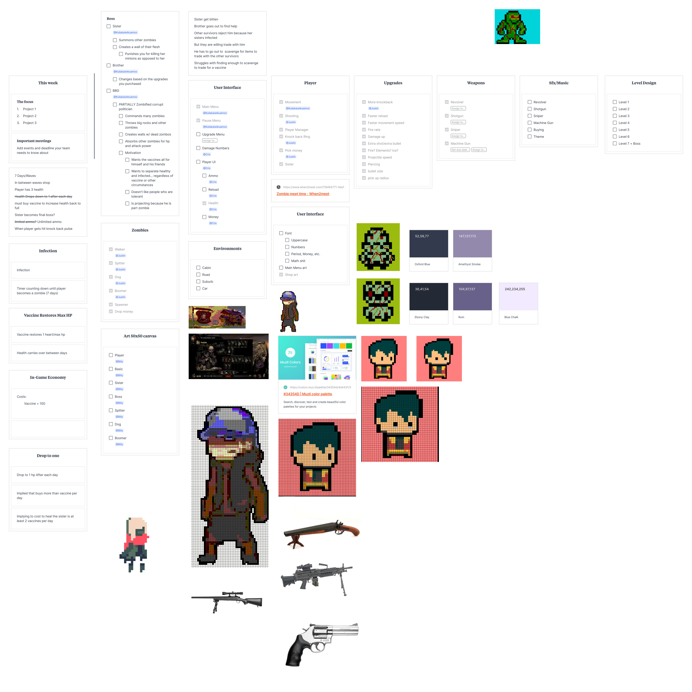

# An Answer for the Dust

## Table of Contents
- [Overview](#overview)
- [Development](#development)
- [Dev Diary](#dev-diary)
- [Meet the Developers](#meet-the-developers)

## Overview

### Synopsis
Lorem ipsum dolor sit amet, consectetur adipiscing elit, sed do eiusmod tempor incididunt ut labore et dolore magna aliqua. Ut enim ad minim veniam, quis nostrud exercitation ullamco laboris nisi ut aliquip ex ea commodo consequat. Duis aute irure dolor in reprehenderit in voluptate velit esse cillum dolore eu fugiat nulla pariatur. Excepteur sint occaecat cupidatat non proident, sunt in culpa qui officia deserunt mollit anim id est laborum.

### Our Vision
Lorem ipsum dolor sit amet, consectetur adipiscing elit, sed do eiusmod tempor incididunt ut labore et dolore magna aliqua. Ut enim ad minim veniam, quis nostrud exercitation ullamco laboris nisi ut aliquip ex ea commodo consequat. Duis aute irure dolor in reprehenderit in voluptate velit esse cillum dolore eu fugiat nulla pariatur. Excepteur sint occaecat cupidatat non proident, sunt in culpa qui officia deserunt mollit anim id est laborum.

## Development

### Projectiles and Shooting

Shooting in games is done in one of two ways. They either use raycasts or spawn game objects bullets from a designated firing point. Our game we decided to use the spawning method. One hurdle I had to figure out was how to spawn multiple bullets in a fixed pattern. When the player upgrades their weapon to increase their projectile count, bullets need to be spawned in a fan-like pattern. My first attempt to deal with this problem was to create new firing points for each bullet. This would prove to be problematic when the projectile count increased and the firing pattern changed. There would be way too many firing points that would need to be managed. Instead I manipulated the single firing point and rotated it to create the fan-shaped pattern. I was able to do this by creating a switch statement and assigning each case according to the number of projectiles. I would spawn bullets in each of the desired directions then use a helper script to give each bullet the correct values and force. This of course still had its downsides, the pattern was hard coded into the script and if it were to be changed, one would need to open the script and change them manually. This reduced the amount of firing points to just one and removed the need to create more than a dozen different firing points for the different patterns. In addition, if I wanted to create a new pattern with an additional projectile I would have to code that pattern manually into the script.

### Storyboard

### Work Distribution & Task Management

Please zoom in to get a clearer view of our taskboard!

## Dev Diary

### Cris Javier

This project has really opened my eyes to how a video game production group can be. It's nowhere near what a normal company would be like but the environments and work-flow seem to be very similar. This game is looking to be very fun yet challenging. We're working very hard on making the underlying themes of 'sacrifice' and 'hope' very apparent. However, at the current moment those implementaitons are nothing more than ideas on our task manager board. I hope to be able to see this project to completion and produce a product I am happy to have my name on!

### Justin Yip

Lorem ipsum dolor sit amet, consectetur adipiscing elit, sed do eiusmod tempor incididunt ut labore et dolore magna aliqua. Ut enim ad minim veniam, quis nostrud exercitation ullamco laboris nisi ut aliquip ex ea commodo consequat. Duis aute irure dolor in reprehenderit in voluptate velit esse cillum dolore eu fugiat nulla pariatur. Excepteur sint occaecat cupidatat non proident, sunt in culpa qui officia deserunt mollit anim id est laborum.

### Billy Kane

Lorem ipsum dolor sit amet, consectetur adipiscing elit, sed do eiusmod tempor incididunt ut labore et dolore magna aliqua. Ut enim ad minim veniam, quis nostrud exercitation ullamco laboris nisi ut aliquip ex ea commodo consequat. Duis aute irure dolor in reprehenderit in voluptate velit esse cillum dolore eu fugiat nulla pariatur. Excepteur sint occaecat cupidatat non proident, sunt in culpa qui officia deserunt mollit anim id est laborum.

### Kaiwi Akioka

Lorem ipsum dolor sit amet, consectetur adipiscing elit, sed do eiusmod tempor incididunt ut labore et dolore magna aliqua. Ut enim ad minim veniam, quis nostrud exercitation ullamco laboris nisi ut aliquip ex ea commodo consequat. Duis aute irure dolor in reprehenderit in voluptate velit esse cillum dolore eu fugiat nulla pariatur. Excepteur sint occaecat cupidatat non proident, sunt in culpa qui officia deserunt mollit anim id est laborum.

## Meet the Developers

- [Cris Javier](https://crisjavier.github.io/)
- [Justin Yip]([github-link](https://github.com/jyip808))
- [Billy Kane](link-to-somewhere)
- [Kaiwi Akioka]([github-link](https://github.com/Kakioka))
